<div align="center">
     <p align="center">
           
     </p>
     <h1>Fastapi-Vue3-Admin </h1>
     <h3>A modern, open-source, full-stack integrated rapid development platform for mid - and back - end systems</h3>
     <p>If you like this project, please give it a ⭐️ to show your support!</p>
     <p align="center">
          <a href="https://gitee.com/tao__tao/fastapi_vue3_admin.git" target="_blank">
               
          </a>
          <a href="https://github.com/1014TaoTao/fastapi_vue3_admin.git" target="_blank">
               
          </a>
          <a href="https://gitee.com/tao__tao/fastapi_vue3_admin/blob/master/LICENSE" target="_blank">
               
          </a>
           
           
           
           
           
           
           
     </p>
</div>

---

English | [Chinese](./README.md)

---

## 📘 Project Introduction (Author: @1014TaoTao)

**Fastapi-Vue3-Admin** is a **completely open-source, highly modular, and technologically advanced modern rapid development platform**. Its aim is to help developers efficiently build high-quality enterprise-level mid - and back - end systems. This project adopts a **front - end and back - end separation architecture**, integrating the Python back - end framework `FastAPI` and the mainstream front - end framework `Vue3` to achieve unified development across multiple terminals, providing a one - stop out - of - the - box development experience.

> **Original Design Concept**: With modularity and loose coupling at its core, it pursues rich functional modules, simple and easy - to - use interfaces, detailed development documentation, and convenient maintenance methods. By unifying frameworks and components, it reduces the cost of technology selection, follows development specifications and design patterns, builds a powerful code hierarchical model, and comes with comprehensive local Chinese support. It is specifically tailored for team and enterprise development scenarios.

```sh
fastapi_vue3_admin
├─ backend        # Backend project
├─ frontend       # Frontend project
├─ devops         # Deployment project
├─ docker-compose.yaml # Deployment file
├─ start.sh       # One-click deployment script
├─ LICENSE        # License agreement
|─ README.en.md   # English documentation
└─ README.md      # Chinese documentation
```

---

## ✨ Core Highlights

| Feature | Description |
| ---- | ---- |
| 🔭 Rapid Development | A completely open-source modern rapid development platform designed to help developers efficiently build high-quality mid- and back-end systems. |
| 🌐 Full-stack Integration | Front-end and back-end separation, integrating Python (FastAPI) + Vue3 for multi-terminal development. |
| 🧱 Modular Design | Highly decoupled system functions, facilitating easy expansion and maintenance. |
| ⚡️ High-performance Asynchronous | Uses the FastAPI asynchronous framework + Redis cache to optimize API response speed. |
| 🔒 Secure Authentication | Supports the JWT OAuth2 authentication mechanism to ensure system security. |
| 📊 Permission Management | The RBAC model enables fine-grained permission control at the menu, button, and data levels. |
| 🚀 Rapid Deployment | Supports one-click deployment with Docker/Docker Compose/Nginx. |
| 📄 Developer-friendly | Provides comprehensive Chinese documentation, a Chinese interface, and a visual toolchain to reduce the learning curve. |
| 🚀 Quick Access | Based on mainstream front-end technology stacks such as Vue3, Vite5, Pinia, and ElementPlus, it's ready to use out of the box. |

---

## 🛠️ Technology Stack Overview

| Type     | Technology Selection            | Description |
|----------|---------------------------------|---------------------------------|
| Backend Framework | FastAPI / Uvicorn / Pydantic 2.0 / Alembic | A modern, high-performance asynchronous framework with enforced type constraints and data migration capabilities. |
| ORM      | SQLAlchemy 2.0      | A powerful ORM library. |
| Scheduled Tasks | APScheduler         | Easily implement scheduled tasks. |
| Authentication | PyJWT               | Implement JWT authentication. |
| Frontend Framework | Vue3 / Vite5 / Pinia / TypeScript | Quickly develop Vue3 applications. |
| UI Library    | ElementPlus | Quickly develop beautiful UI components. |
| Database   | MySQL / MongoDB     | Powerful databases. |
| Cache     | Redis               | A powerful caching database. |
| Documentation     | Swagger / Redoc     | Automatically generate API documentation. |
| Deployment     | Docker / Nginx / Docker Compose | Quickly deploy projects. |

---

## 📌 Built-in Modules

| Module Name     | Sub-module Name | Description |
|----------|---------------------|---------------------|
| Dashboard    | Workbench, Analysis Page  | Entry for commonly used functions |
| System Management  | Includes sub-modules such as menu, department, position, role, user, log, configuration, announcement, dictionary, and task | Main system functions |
| Monitoring Management  | Online users, server monitoring, cache monitoring | System monitoring and management functions |
| Public Management  | Interface management, document management | Project interface documentation |

---

## 🍪 Demo Environment

- Official website: <https://service.fastapiadmin.com>
- Web address: <https://service.fastapiadmin.com/web>
- App address: <https://service.fastapiadmin.com/app>
- Admin account: `admin` Password: `123456`
- Demo account: `demo` Password: `123456`

---

## 👷 Installation and Usage

### Version Information

| Type     | Technology Stack     | Version       |
|----------|----------------------|---------------|
| Backend  | Python               | >=3.10        |
| Backend  | FastAPI              | 0.109         |
| Frontend | Node.js              | >= 20.0 (It is recommended to use the latest version.) |
| Frontend | npm                  | 16.14         |
| Frontend | Vue3                 | 3.3           |
| Database | MySQL                | 8.0 (It is recommended to use the latest version.) |
| Middleware | Redis              | 7.0 (It is recommended to use the latest version.) |

---

### Get Code

```sh
# Clone the code to your local machine
git clone https://gitee.com/tao__tao/fastapi_vue3_admin.git
或
git clone https://github.com/1014TaoTao/fastapi_vue3_admin.git
```

---

### Local Backend Start

```sh
# Enter the backend project directory
cd backend
# Install dependencies
pip3 install -r requirements.txt
# Start the backend service
python3 main.py run
or
python3 main.py run --env=dev
# Generate migration files
python3 main.py revision "Initial migration" --env=dev (default is dev if not specified)
# Apply migrations
python3 main.py upgrade --env=dev (default is dev if not specified)
```

---

### Local Frontend Start

```sh
# Enter the frontend project directory
cd frontend
# Install dependencies
pnpm install
# Start the frontend service
pnpm run dev
# Build the frontend and generate the `frontend/dist` directory
pnpm run build
```

---

### Local App H5 Start

```sh
# Enter the fastapp project directory
cd fastapp
# Install dependencies
pnpm install
# Start the fastapp service
pnpm run dev:h5
# Build the fastapp and generate the `fastapp/dist/build/h5` directory
pnpm run build:h5
```

---

### Local Project Website Start

```sh
# Enter the fastdocs project directory
cd fastdocs
# Install dependencies
pnpm install
# Run the documentation project
pnpm run docs:dev
# Build the documentation project and generate the `fastdocs/dist` directory
pnpm run docs:build
```

---

### Local Access Address

- Project official website address: <http://localhost:5180>
- Web frontend address: <http://localhost:5180/web>
- App frontend address: <http://localhost:5180/app>
- Admin account: `admin` Password: `123456`
- Demo account: `demo` Password: `123456`

---

### Docker Build

```sh
# Copy the script `fastapi_vue3_admin/start.sh` to the server and grant execution permissions
chmod +x start.sh
# Execute the script
./deploy.sh
# View images:
docker images -a
# View containers:
docker compose ps
# View logs
docker logs -f <Container Name>
# Stop the service
docker compose down
# Delete an image
docker rmi <Image Name>
# Delete a container
docker rm <Container Name>
# Backend configuration file directory
fastapi_vue3_admin/backend/env/.env.prod.py
# Frontend configuration file directory
fastapi_vue3_admin/frontend/vite.config.ts
and 
fastapi_vue3_admin/frontend/.env.production
# Deployment file directory  
fastapi_vue3_admin/docker-compose.yaml
and 
fastapi_vue3_admin/devops/devops/nginx/nginx.conf

```

---

## 🔧 Models

| Module | Screenshot |
|------------|---------------------------------|
| Login      | 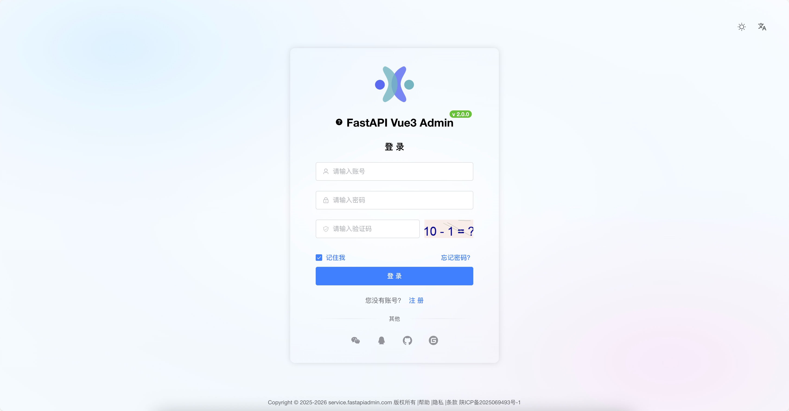 |
| Dashboard  | 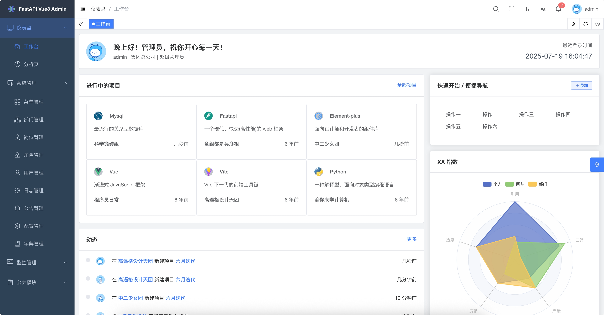 |
| Analysis   | 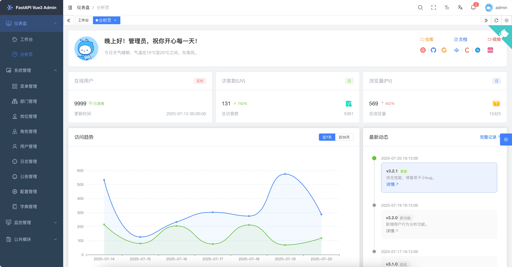 |
| Menu       |  |
| Department | 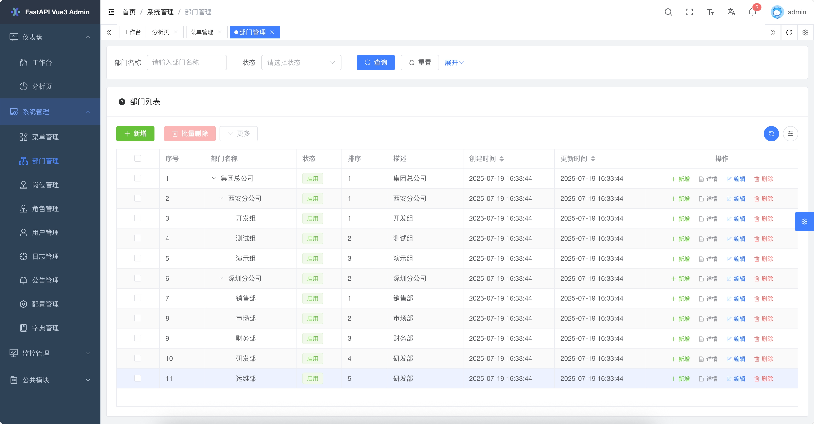 |
| Position   | 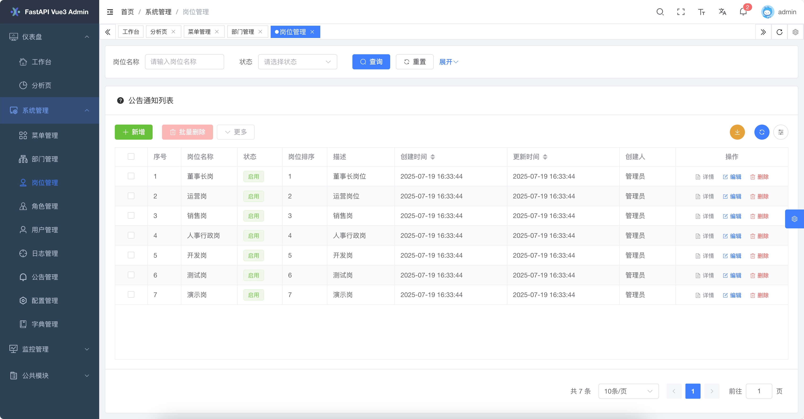 |
| Role       | 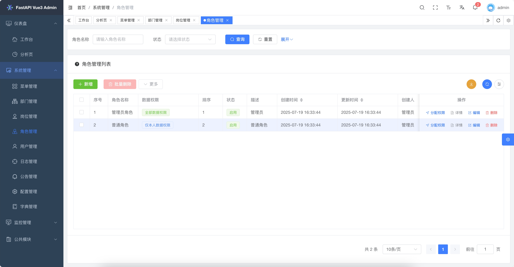 |
| User       | 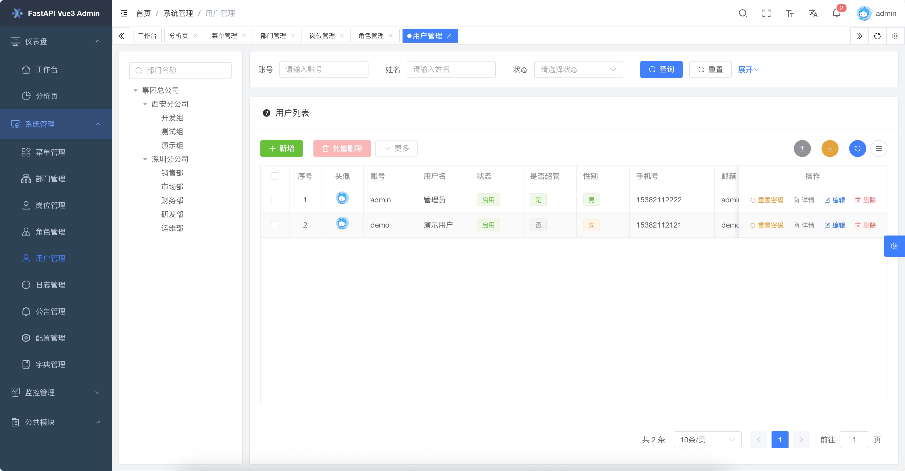 |
| Log        | 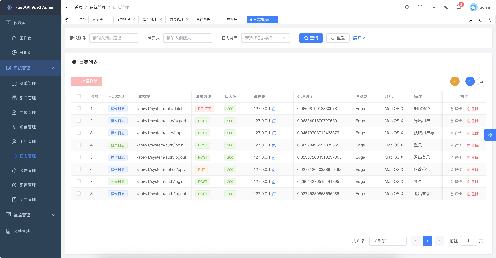 |
| Config     | 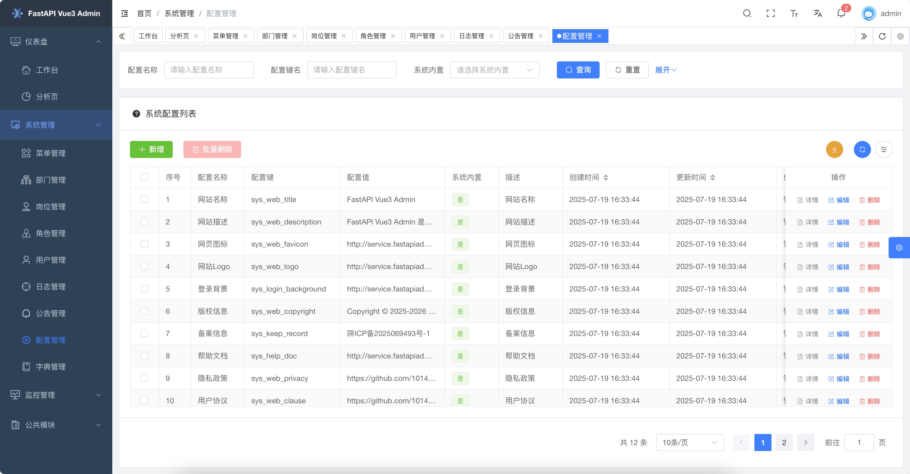 |
| OnlineUser | 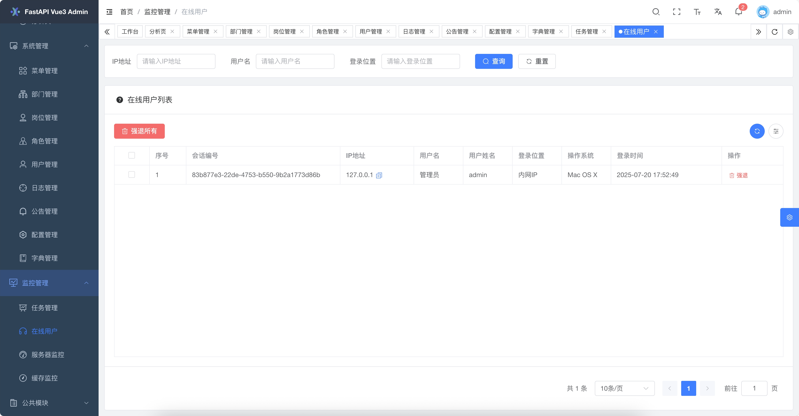 |
| Server     | 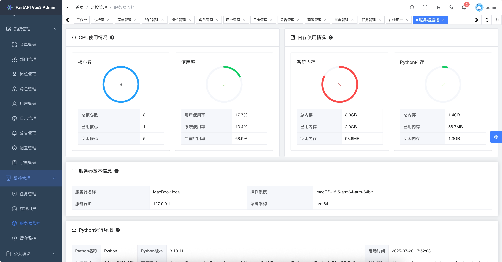 |
| Cache      | 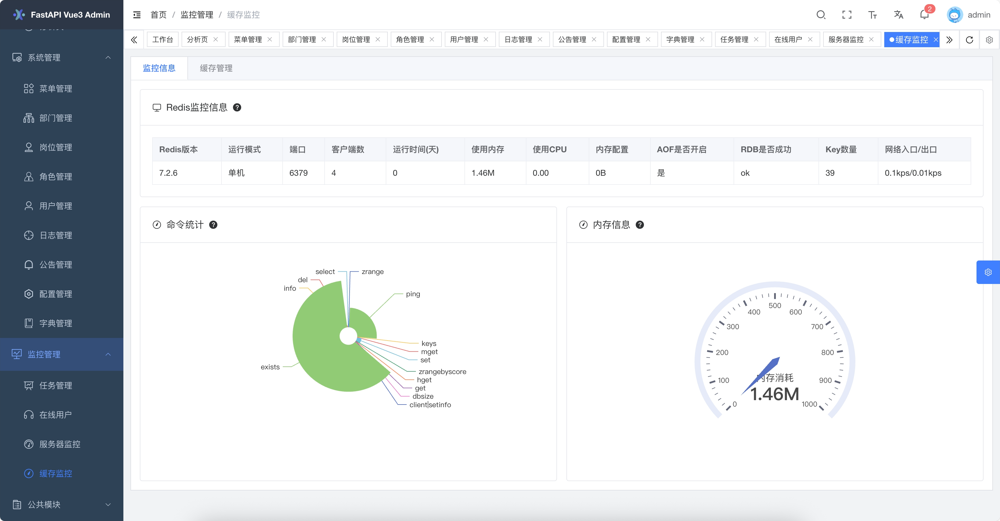 |
| Task       | 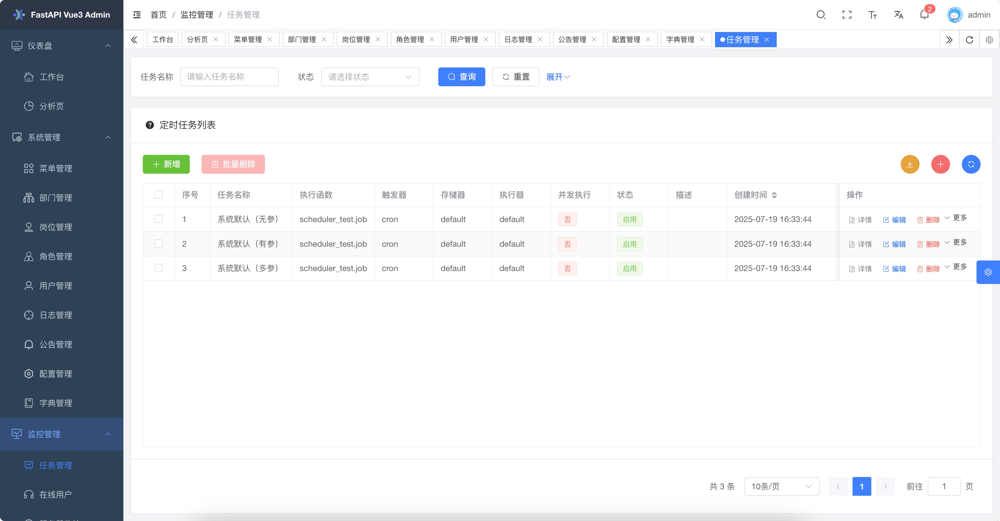 |
| Dict       | 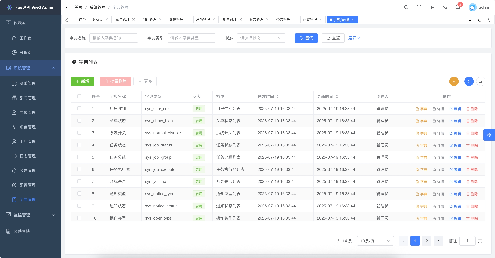 |
| API Docs   | 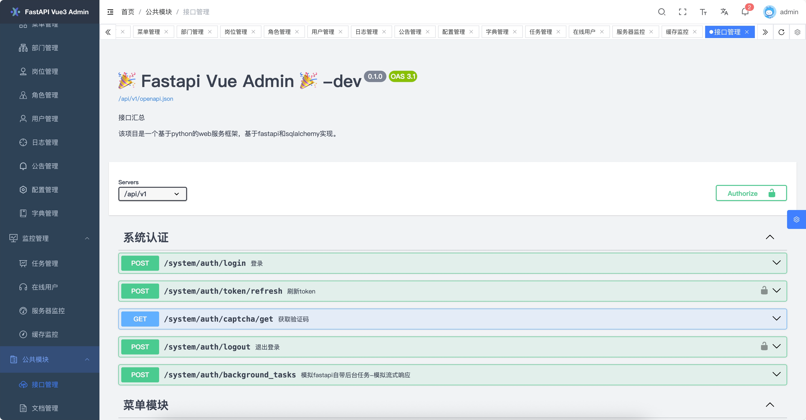 |
| Theme      |  |
| Document   | 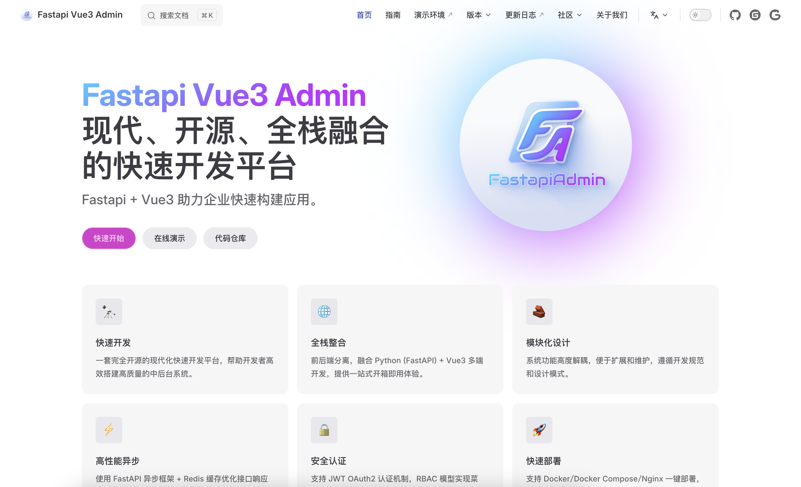 |
| Lock       |  |

### 移动端

| Module Name | Screenshot |
|----------|------|
| Login      | Under development... (To be completed) |

---

## 🛠️ Secondary Development Tutorial

### Backend Part

1. **Write the Entity Class Layer**: Create the ORM model for the demo in `backend/app/v1/models/demo/demo_model.py` (corresponding to the entity class layer in Spring Boot).
2. **Write the Data Model Layer**: Create the demo data model in `backend/app/v1/schemas/demo/demo_schema.py` (corresponding to the DTO layer in Spring Boot).
3. **Write the Query Parameter Model Layer**: Create the query parameter model for the demo in `backend/app/v1/params/demo/demo_param.py` (corresponding to the DTO layer in Spring Boot).
4. **Write the Persistence Layer**: Create the demo data layer in `backend/app/v1/cruds/demo/demo_crud.py` (corresponding to the Mapper or DAO layer in Spring Boot).
5. **Write the Business Layer**: Create the demo data layer in `backend/app/v1/services/demo/demo_service.py` (corresponding to the Service layer in Spring Boot).
6. **Write the Interface Layer**: Create the demo data layer in `backend/app/v1/controllers/demo/demo_controller.py` (corresponding to the Controller layer in Spring Boot).
7. **Register Backend Routes**: Register the demo routes in `backend/app/v1/urls/demo/demo_url.py`.
8. **Register Routes to the FastAPI Service**: Register the routes in `backend/plugin/init_app.py`.
9. **Add the Demo Module to the System Initialization Script**: Add it in `backend/app/scripts/initialize.py` (if necessary, you can configure the demo menu permissions in `backend/app/scripts/data/system_menu.json` and `backend/app/scripts/data/system_role_menus.json` or from the frontend page menu).
10. **Add the Demo Module to the Database Migration Script**: Add it in `backend/app/alembic/env.py`.

### Frontend Part

1. **Configure the Frontend to Access the Backend Interface Address**: Configure it in `frontend/src/api/demo/example.ts`.
2. **Write the Frontend Page**: Write it in `frontend/src/views/demo/example/index.vue`.

---

## 🙏 Thanks

Thanks to the contributions and support of the following projects, which have enabled the successful completion of this project:

- [FastAPI Project](https://fastapi.tiangolo.com/)
- [Vue3 Project](https://v3.cn.vuejs.org/)
- [KInit Project](https://gitee.com/ktianc/kinit)
- [Fastapi-Vue3-Admin Project](https://gitee.com/senqi666/fastapi-vue-admin)
- [Vue-FastAPI-Admin Project](https://gitee.com/mizhexiaoxiao/vue-fastapi-admin)
- [RuoYi-Vue3-FastAPI Project](https://gitee.com/insistence2022/RuoYi-Vue3-FastAPI)
- [APScheduler Project](https://github.com/agronholm/apscheduler)
- [Vite Project](https://github.com/vitejs/vite)
- [Vue3-element-admin Project](https://gitee.com/youlaiorg/vue3-element-admin)
- [Vue3-element-plus-admin Project](https://gitee.com/kailong110120130/vue-element-plus-admin)

---

## 🎨 Community

| WeChat QR Code | Group QR Code | WeChat Pay QR Code |
| --- | --- | --- |
|  |  |  |

---

## ❤️ Star

If you like this project, please give it a ⭐️ Star to show your support! Thank you very much!
