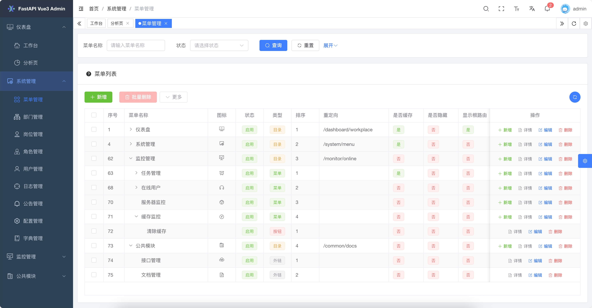
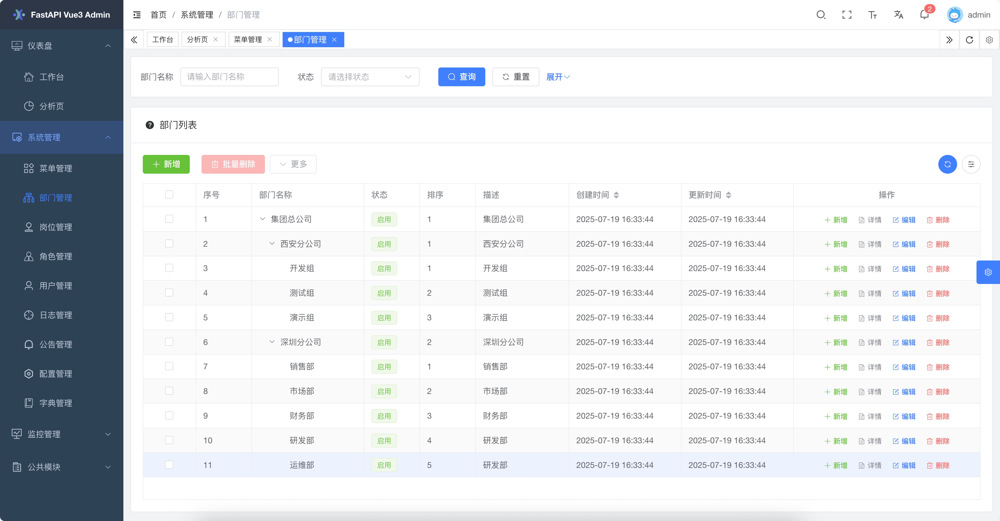
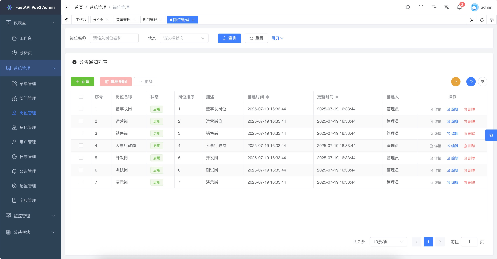
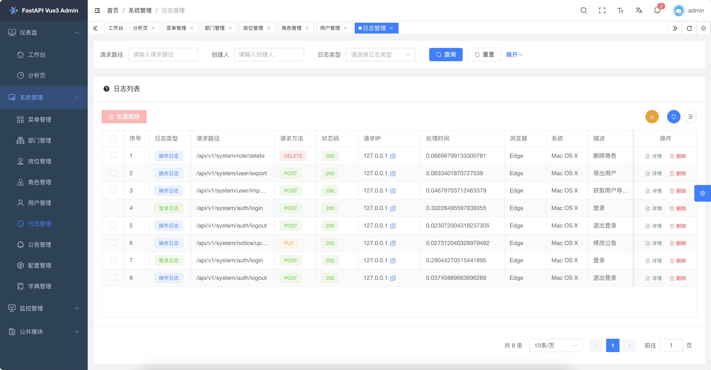
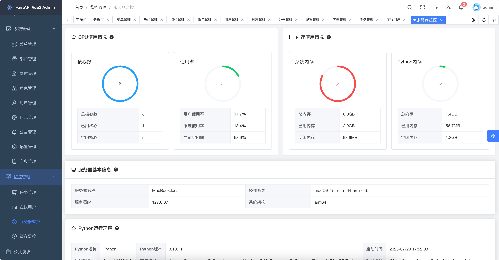
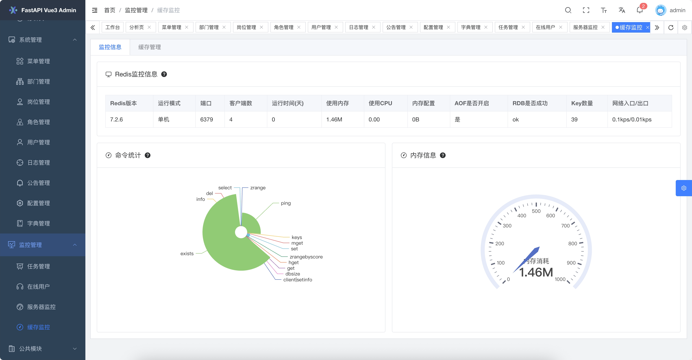
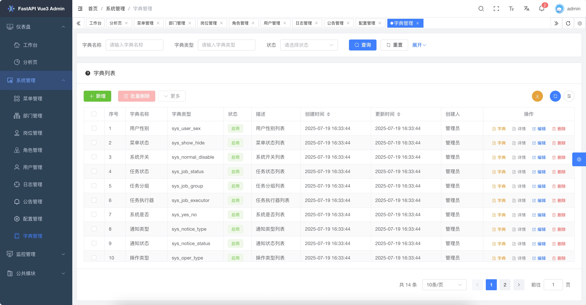
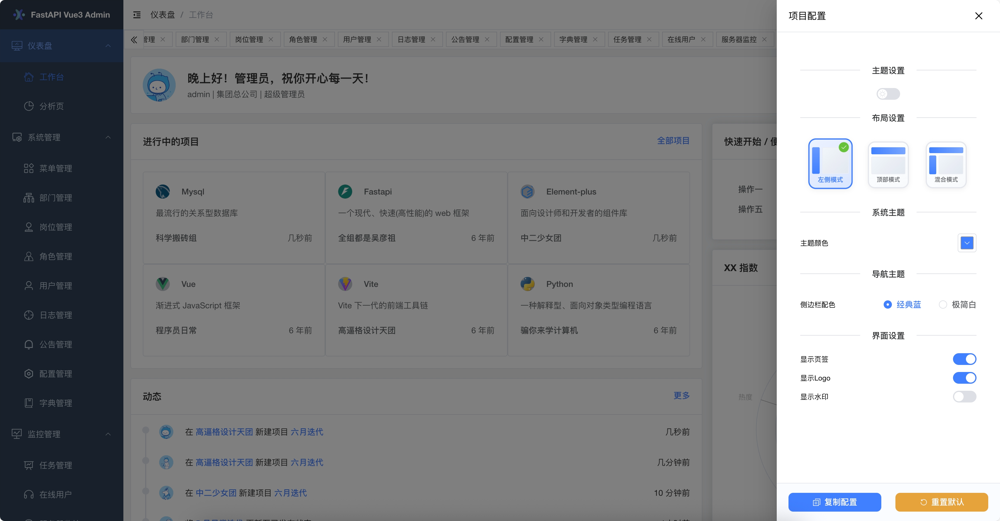

<div align="center">
     <p align="center">
            
     </p>
     <h1>Fastapi-Vue3-Admin <sup style="background-color: #28a745; color: white; padding: 2px 6px; border-radius: 3px; font-size: 0.4em; vertical-align: super; margin-left: 5px;">v2.0.0</h1>
     <h3>一套现代、开源、全栈融合的中后台快速开发平台</h3>
     <p>如果你喜欢这个项目，给个 ⭐️ 支持一下吧！</p>
     <p align="center">
          <a href="https://gitee.com/tao__tao/fastapi_vue3_admin.git" target="_blank">
               
          </a>
          <a href="https://github.com/1014TaoTao/fastapi_vue3_admin.git" target="_blank">
               
          </a>
          <a href="https://gitee.com/tao__tao/fastapi_vue3_admin/blob/master/LICENSE" target="_blank">
               
          </a>
           
           
           
           
           
           
           
     </p>
</div>

---

简体中文 | [English](./README.en.md)

---

## 📘 项目介绍（作者：@1014TaoTao）

**Fastapi-Vue3-Admin** 是一套 **完全开源、高度模块化、技术先进的现代化快速开发平台**，旨在帮助开发者高效搭建高质量的企业级中后台系统。该项目采用 **前后端分离架构**，融合 Python 后端框架 `FastAPI` 和前端主流框架 `Vue3` 实现多端统一开发，提供了一站式开箱即用的开发体验。

> **设计初心**: 以模块化、松耦合为核心，追求丰富的功能模块、简洁易用的接口、详尽的开发文档和便捷的维护方式。通过统一框架和组件，降低技术选型成本，遵循开发规范和设计模式，构建强大的代码分层模型，搭配完善的本地中文化支持，专为团队和企业开发场景量身定制。

```sh
fastapi_vue3_admin
├─ backend               # 后端工程
├─ frontend              # 前端工程
├─ fastapp               # 小程序工程
├─ fastdocs              # 官网文档
├─ devops                # 部署工程
├─ docker-compose.yaml   # 部署文件
├─ start.sh              # 部署脚本
├─ LICENSE               # 许可协议
|─ README.en.md          # 英文文档
└─ README.md             # 中文文档
```

---

## ✨ 核心亮点

| 特性 | 描述 |
| ---- | ---- |
| 🔭 快速开发 |一套完全开源的现代化快速开发平台，旨在帮助开发者高效搭建高质量的中后台系统。|
| 🌐 全栈整合 | 前后端分离，融合 Python (FastAPI) + Vue3 多端开发 |
| 🧱 模块化设计 | 系统功能高度解耦，便于扩展和维护 |
| ⚡️ 高性能异步 | 使用 FastAPI 异步框架 + Redis 缓存优化接口响应速度 |
| 🔒 安全认证 | 支持 JWT OAuth2 认证机制，保障系统安全 |
| 📊 权限管理 | RBAC 模型实现菜单、按钮、数据级别的细粒度权限控制 |
| 🚀 快速部署 | 支持 Docker/Docker Compose/Nginx 一键部署 |
| 📄 开发友好 | 提供完善的中文文档 + 中文化界面 + 可视化工具链，降低学习成本 |
| 🚀 快速接入 |基于 Vue3、Vite5、Pinia、ElementPlus 等主流前端技术栈，开箱即用。|

---

## 🛠️ 技术栈概览

| 类型     | 技术选型            | 描述 |
|----------|---------------------|---------------------|
| 后端框架 | FastAPI / Uvicorn / Pydantic 2.0 / Alembic | 现代、高性能的异步框架，强制类型约束，数据迁移。 |
| ORM      | SQLAlchemy 2.0      | 强大的 ORM 库。 |
| 定时任务 | APScheduler         | 轻松实现定时任务。 |
| 权限认证 | PyJWT               | 实现 JWT 认证。 |
| 前端框架 | Vue3 / Vite5 / Pinia / TypeScript | 快速开发 Vue3 应用。 |
| UI 库    | ElementPlus | 快速开发美观的 UI 组件。 |
| 数据库   | MySQL / MongoDB     | 强大的数据库。 |
| 缓存     | Redis               | 强大的缓存数据库。 |
| 文档     | Swagger / Redoc     | 自动生成 API 文档。 |
| 部署     | Docker / Nginx / Docker Compose | 快速部署项目。 |

---

## 📌 内置模块

| 模块名     | 子模块名 | 描述 |
|----------|---------------------|---------------------|
| 仪表盘    | 工作台 、分析页  |常用功能入口 |
| 系统管理  | 包含菜单、部门、岗位、角色、用户、日志、配置、公告、字典、任务等子模块|系统主功能 |
| 监控管理  | 在线用户、服务器监控、缓存监控 |系统监控管理功能 |
| 公共管理  | 接口管理、文档管理|项目接口文档 |

---

## 🍪  演示环境

- 官网地址：<https://service.fastapiadmin.com>
- 演示地址：<https://service.fastapiadmin.com/web>
- 小程序地址：<https://service.fastapiadmin.com/app>
- 管理员账号：`admin` 密码：`123456`
- 演示账号：`demo` 密码：`123456`

---

## 👷 安装和使用

### 版本说明

| 类型     | 技术栈     | 版本       |
|----------|------------|------------|
| 后端     | Python     | >=3.100       |
| 后端     | FastAPI    | 0.109      |
| 前端     | Node.js    | >= 20.0（推荐使用最新版）|
| 前端     | npm        | 16.14      |
| 前端     | Vue3       | 3.3        |
| 数据库   | MySQL      | 8.0 （推荐使用最新版）|
| 中间件   | Redis      | 7.0 （推荐使用最新版）|

---

### 获取代码  

```sh
# 克隆代码到本地
git clone https://gitee.com/tao__tao/fastapi_vue3_admin.git
或
git clone https://github.com/1014TaoTao/fastapi_vue3_admin.git
```

---

### 本地后端启动

```sh
#  进入后端工程目录
cd backend
# 安装依赖
pip3 install -r requirements.txt
# 启动后端服务
python3 main.py run 
或 
python3 main.py run--env=dev 
# 生成迁移文件
python3 main.py revision "初始化迁移" --env=dev(不加默认为dev)
# 应用迁移
python3 main.py upgrade --env=dev(不加默认为dev)
```

---

### 本地前端启动

```sh
# 进入前端工程目录
cd frontend
# 安装依赖
pnpm install
# 启动前端服务
pnpm run dev
# 构建前端, 生成 `frontend/dist` 目录
pnpm run build
```

---

### 本地小程序h5启动

```sh
# 进入前端工程目录
cd fastapp
# 安装依赖
pnpm install
# 启动前端服务
pnpm run dev:h5
# 构建前端, 生成 `frontend/dist/build/h5` 目录
pnpm run build:h5
```

---

### 本地项目官网启动

```sh
# 进入前端工程目录
cd fastdocs
# 安装依赖
pnpm install
# 运行文档工程
pnpm run docs:dev
# 构建文档工程, 生成 `fastdocs/dist` 目录
pnpm run docs:build
```

---

### 本地访问地址

- 项目官网地址: <http://localhost:5180>
- web前端地址: <http://localhost:5180/web>
- 小程序h5前端地址: <http://localhost:5180/app>
- 管理员账号：`admin` 密码：`123456`
- 演示账号：`demo` 密码：`123456`

---

### docker 部署

```sh
# 复制脚本 `fastapi_vue3_amdin/start.sh` 脚本文件到服务器, 并赋予执行权限
chmod +x start.sh
# 执行脚本
./deploy.sh
# 查看镜像:
docsker images -a
# 查看容器:
docsker compose ps
# 查看日志
docker logs -f <容器名>
# 服务停止
docsker compose down
# 删除镜像
docker rmi <镜像名>
# 删除容器
docker rm <容器名>
# 后端配置文件目录
fastapi_vue3_amdin/backend/env/.env.prod.py
# 前端配置文件目录
fastapi_vue3_amdin/frontend/vite.config.ts
和 
fastapi_vue3_amdin/frontend/.env.production
# 部署文件目录  
fastapi_vue3_amdin/docker-compose.yaml
和 
fastapi_vue3_amdin/devops/devops/nginx/nginx.conf

```

---

## 🔧 模块展示

### web 端

| 模块名 <div style="width:60px"/> | 截图 |
| ----- | --- |
| 登录     |  |
| 仪表盘   |  |
| 分析页   |  |
| 菜单管理  |  |
| 部门管理  |  |
| 岗位管理  |  |
| 角色管理  |  |
| 用户管理  |  |
| 日志管理  |  |
| 配置管理  |  |
| 在线用户  |  |
| 服务器监控 |  |
| 缓存监控  |  |
| 任务管理  |  |
| 字典管理  |  |
| 接口管理  |  |
| 系统主题  |  |
| 在线文档  |  |
| 系统锁屏  |  |

### 移动端

| 模块名 | 截图 |
|----------|------|
| 登录      | 开发中... （待完成） |

---

## 🛠️ 二开教程

### 后端部分

1. **编写实体类层**：在 `backend/app/v1/models/demo/demo_model.py` 中创建 demo 的 ORM 模型（对应 Spring Boot 中的实体类层）
2. **编写数据模型层**：在 `backend/app/v1/schemas/demo/demo_schema.py` 中创建 demo 数据模型（对应 Spring Boot 中的 DTO 层）
3. **编写查询参数模型层**：在 `backend/app/v1/params/demo/demo_param.py` 中创建 demo 的查询参数模型（对应 Spring Boot 中的 DTO 层）
4. **编写持久化层**：在 `backend/app/v1/cruds/demo/demo_crud.py` 中创建 demo 数据层（对应 Spring Boot 中的 Mapper 或 DAO 层）
5. **编写业务层**：在 `backend/app/v1/services/demo/demo_service.py` 中创建 demo 数据层（对应 Spring Boot 中的 Service 层）
6. **编写接口层**：在 `backend/app/v1/controllers/demo/demo_controller.py` 中创建 demo 数据层（对应 Spring Boot 中的 Controller 层）
7. **注册后端路由**：在 `backend/app/v1/urls/demo/demo_url.py` 中注册 demo 路由
8. **注册路由到 FastAPI 服务中**：在 `backend/plugin/init_app.py` 中注册路由
9. **将 demo 模块添加至系统初始化脚本**：在 `backend/app/scripts/initialize.py` 中添加（如果需要可以把 demo 的菜单权限，配置到 `backend/app/scripts/data/system_menu.json` 和 `backend/app/scripts/data/system_role_menus.json` 或从前端页面菜单中新增）
10. **将 demo 模块添加至数据库迁移脚本中**：在 `backend/app/alembic/env.py` 中添加

### 前端部分

1. **前端接入后端接口地址**：在 `frontend/src/api/demo/example.ts` 中配置
2. **编写前端页面**：在 `frontend/src/views/demo/example/index.vue` 中编写

---

## 🙏 特别鸣谢

感谢以下项目的贡献和支持，使本项目得以顺利完成：

- [FastAPI 项目](https://fastapi.tiangolo.com/)
- [Vue3 项目](https://v3.cn.vuejs.org/)
- [KInit 项目](https://gitee.com/ktianc/kinit)
- [Fastapi-Vue3-Admin 项目](https://gitee.com/senqi666/fastapi-vue-admin)
- [Vue-FastAPI-Admin 项目](https://gitee.com/mizhexiaoxiao/vue-fastapi-admin)
- [RuoYi-Vue3-FastAPI 项目](https://gitee.com/insistence2022/RuoYi-Vue3-FastAPI)
- [APScheduler 项目](https://github.com/agronholm/apscheduler)
- [Vite 项目](https://github.com/vitejs/vite)
- [Vue3-element-admin 项目](https://gitee.com/youlaiorg/vue3-element-admin)
- [Vue3-element-plus-admin 项目](https://gitee.com/kailong110120130/vue-element-plus-admin)

## 🎨 社区

| 微信二维码 | 群组二维码 | 微信支付二维码 |
| --- | --- | --- |
|  |  |  |

---

## ❤️ Star 支持我

   如果你喜欢这个项目，请给我一个 ⭐️ Star 支持一下吧！非常感谢！
