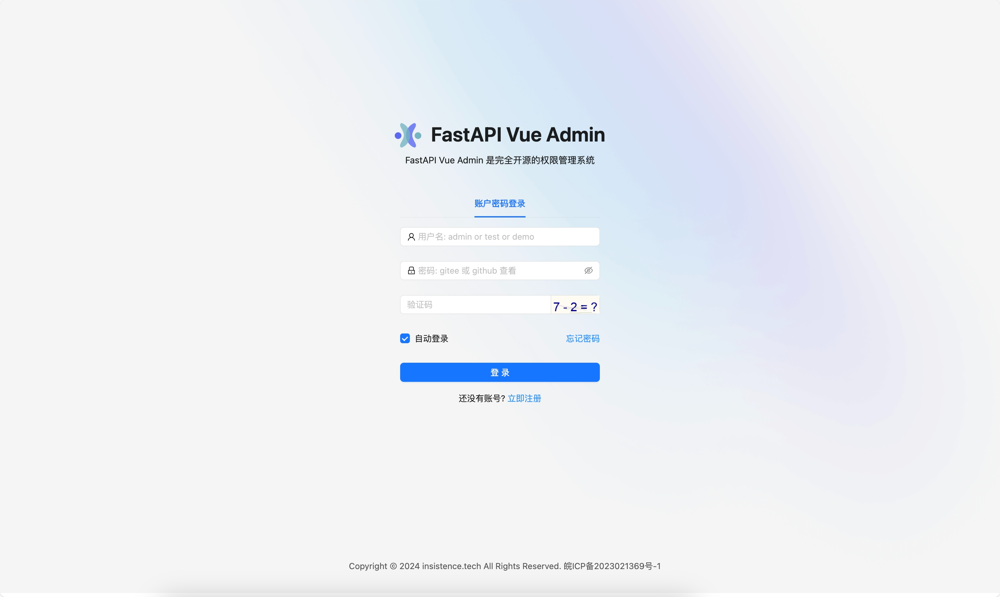
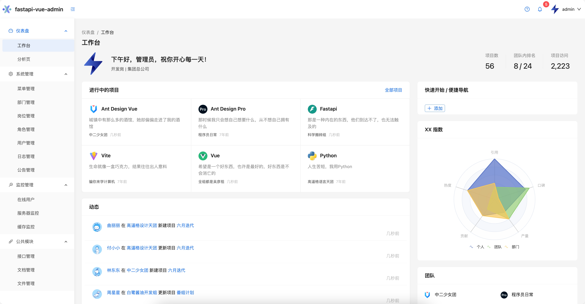
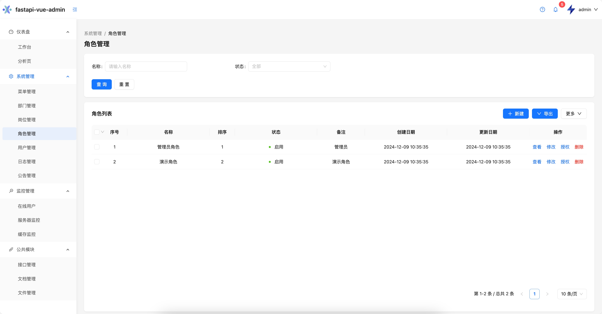
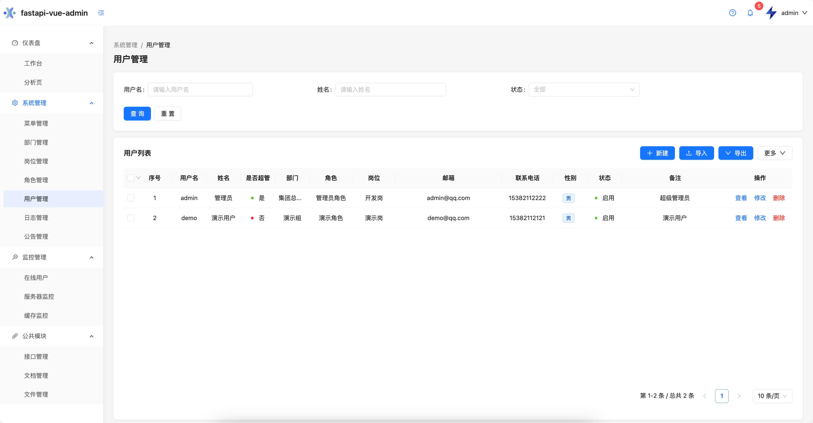
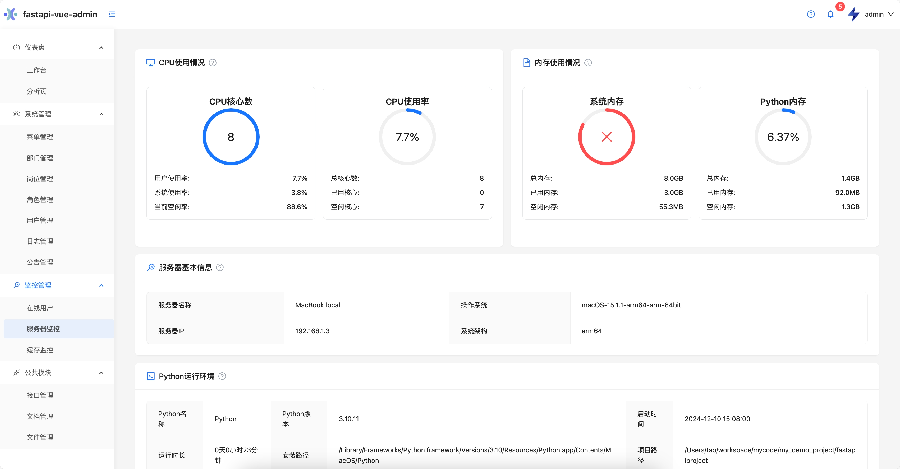
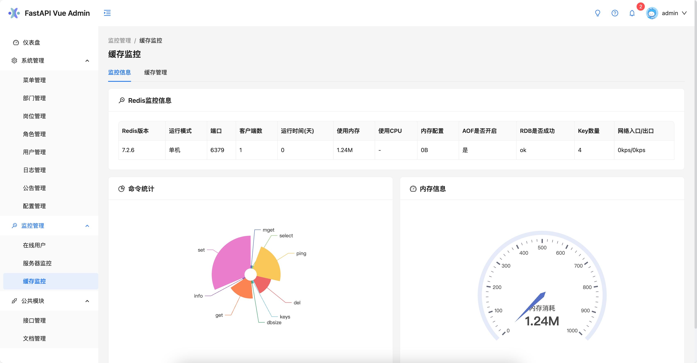
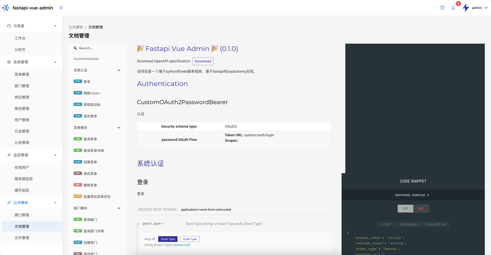
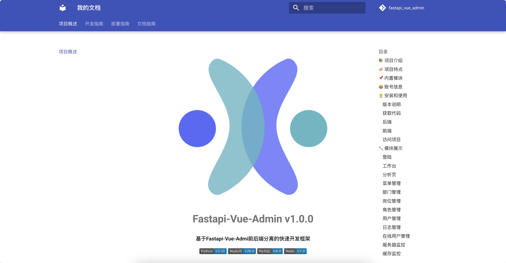
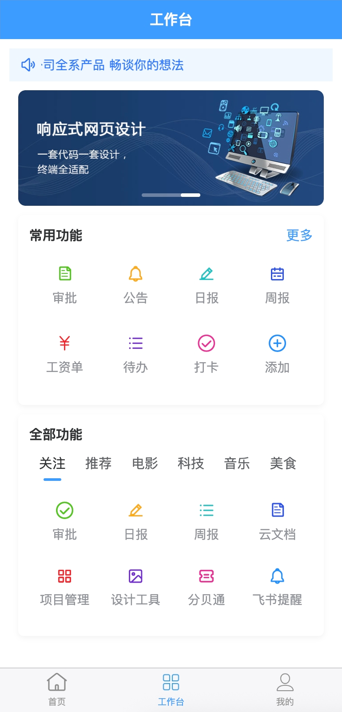

<div align="center">
   <p align="center">
      
   </p>
      <h1 align="center" style="margin: 30px 0 30px; font-weight: bold;">Fastapi-Vue3-Admin v1.0.0</h1>
      <h4 align="center">基于Fastapi-Vue-Admin前后端分离的Web+小程序+H5应用快速开发框架</h4>
   <p align="center">
      <a href="https://gitee.com/tao__tao/fastapi_vue3_admin.git">
         
      </a>
      <a href="https://github.com/1014TaoTao/fastapi_vue3_admin.git">
         
      </a>
      <a href="https://gitee.com/tao__tao/fastapi_vue3_admin/blob/master/LICENSE">
         
      </a>
      
      
      
      
   </p>
</div>

## 📚 项目介绍

**Fastapi-Vue3-Admin** 是一套完全开源的现代化快速开发平台，旨在帮助开发者高效搭建高质量的中后台系统。项目结合了高性能后端框架 FastAPI 和强大的 ORM 库 SQLAlchemy，以及前端技术栈 Vue3、Vite6、Ant Design Vue 和移动端开发框架 UniApp 及其组件库 uView-plus，为开发者提供了开箱即用的解决方案。项目目录结构如下：

```sh
my_demo_project/fastapi_project
├─ backend        # 后端工程
├─ frontend       # 前端工程
├─ devops         # 部署工程
├─ mkdocs         # 文档工程
|─ README.en.md   # 英文文档
└─ README.md      # 中文文档
```

- **后端**：
  - **FastAPI**：现代、高性能的异步框架
  - **Swagger**：自动生成交互式 API 文档
  - **Pydantic**：强制类型约束
  - **SQLAlchemy 2.0**：强大的 ORM 库

- **前端**：
  - **Vue3**：现代前端框架
  - **Ant Design Vue**：企业级 UI 组件库
  - **TypeScript**：静态类型检查
  - **Vite**：快速的构建工具

- **权限认证**：使用哈希密码和 JWT Bearer 令牌的 OAuth2
- **权限架构**：基于 RBAC 设计，支持动态权限菜单、按钮级别权限控制、数据级别权限控制
- **开箱即用**：适合新项目启动模板，也可用于学习参考

如果觉得项目不错，欢迎 Star 支持！

## 🍻 项目特点

- 模块化、松耦合
- 模块丰富、开箱即用
- 简洁易用、快速接入
- 文档详尽、易于维护
- 自顶向下、体系化设计
- 统一框架、统一组件、降低选择成本
- 开发规范、设计模式、代码分层模型
- 强大便捷的开发工具链
- 完善的本地中文化支持
- 设计为团队及企业使用

## 📌 内置模块

- **仪表盘**：仪表盘展示，常用功能入口。

- **系统管理**
  - **菜单管理**：配置系统菜单，操作权限，按钮权限标识等。
  - **部门管理**：配置系统组织机构，树结构展现支持数据权限。
  - **岗位管理**：主要管理用户担任岗位。
  - **角色管理**：角色菜单管理与权限分配、设置角色所拥有的菜单权限。
  - **用户管理**：用于维护管理系统的用户，常规信息的维护与账号设置。
  - **日志管理**：对系统中常用的较为固定的数据进行统一维护。
  - **配置管理**：主要是系统配置信息，如：系统名称、系统版本、系统描述等。
  - **公告管理**：系统通知公告信息发布维护。
  - **字典管理**：对系统中常用的较为固定的数据进行统一维护。
  - **任务管理**：任务调度，支持定时任务，支持任务日志查看。

- **监控管理**
  - **在线用户**：查看当前系统中在线的用户。
  - **服务器监控**：查看系统运行状态，包括内存、CPU、磁盘等。
  - **缓存监控**：查看系统缓存信息，如：缓存命中率、缓存键值等。

- **公共管理**
  - **接口管理**：系统接口维护，如：接口地址、请求方式等。
  - **文档管理**：系统接口文档维护，支持在线接口调用。

## 🍪  账号信息

| 账户类型   | 账号   | 密码   |
| :--------- | :----- | :----- |
| **管理员账户** | admin  | 123456 |
| **演示账户**   | demo   | 123456 |

## 👷 安装和使用

### 版本说明

| 类型     | 技术栈     | 版本       |
|----------|------------|------------|
| 后端     | Python     | 3.10       |
| 后端     | FastAPI    | 0.109      |
| 前端     | Node.js    | >= 20.0（推荐使用最新版）|
| 前端     | npm        | 16.14      |
| 前端     | Vue3       | 3.3        |
| 数据库   | MySQL      | 8.0 （推荐使用最新版）|
| 数据库   | PostgreSQL | 14（其他版本均未测试）|
| 数据库   | MongoDB    | 8.0（推荐使用最新版）|
| 中间件   | Redis      | 7.0 （推荐使用最新版）|

### 获取代码

```sh
git clone https://gitee.com/tao__tao/fastapi_vue3_admin.git
```

### 后端

1. 安装依赖

   ```shell
   cd backend
   pip3 install -r requirements.txt
   ```

2. 修改项目数据库配置信息
   在`app/config/.env.dev(.env.test、.env.prod)`文件中的`DB_DRIVER`数据库驱动类型，以及对应的数据库的配置信息

3. 创建名为`fastapi_vue_admin`的数据库

4. 初始化数据库数据

   ```shell
   # 进入后端根目录 backend 下运行
   # 运行命令后会自动生成数据库内的表和数据
   # 如已初始化数据库数据，此命令可不执行
   python3 main.py init
   ```

5. 启动

   ```shell
   # 进入后端根目录 backend 下运行
   python3 main.py run

   # 修改了模型后需要：重新生成迁移文件，然后应用迁移
   # 生成迁移
   # python main.py revision "初始化迁移" --env=dev(不加默认为dev)
   # 应用迁移
   # python main.py upgrade --env=dev(不加默认为dev)
   ```

### 前端

1. 安装依赖

   ```shell
   cd frontend
   npm install
   ```

2. 运行

   ```shell
   npm run dev
   ```

3. 打包

   ```shell
   npm run build
   ```

### 访问项目

- 前端地址：<http://127.0.0.1:5180>
- 账号：`admin` 密码：`123456`
- 接口地址：<http://127.0.0.1:8000/api/v1/docs>

### docker 部署

- cd fastapi_vue3_amdin/frontend
- npm run build （保证dist前端打包内容存在，否则运行会报错）
- cd fastapi_vue3_amdin
- docker compose up -d
- 注意事项：
- 前端.env.production 中 VITE_API_BASE_URL需要修改为公网地址
- 后端.env.prod 中 MYSQL_HOST、REDIS_HOST需要改为私网地址
- 遇到问题：
- 后端启动报错：一般是由于初始化脚本没有执行，脚本目录：backend/sql/mysql_xxx.sql
- 还有可能是因为mysql、redis中间件没有启动，需要手动启动
- 部署顺序：
- 1. 启动mysql、redis中间件
- 2. 执行初始化脚本
- 3. 启动后端服务
- 4. 启动前端服务
- 访问地址：公网地址，80端口；登录admin/123456
  
## 🔧 模块展示

### 登陆



### 仪表盘



### 菜单管理


### 部门管理


### 岗位管理


### 角色管理



### 用户管理



### 日志管理


### 配置管理


### 在线用户管理


### 服务器监控



### 缓存监控



### 任务管理


### 字典管理


### 接口管理


### 文档管理



### 个人信息


### 在线文档



### app登录


### app首页


### app工作台



### app个人中心


### app个人主页


## ✨ 特别鸣谢

感谢以下项目的贡献和支持，使本项目得以顺利完成：

- [FastAPI 项目](https://fastapi.tiangolo.com/)
- [Vue3 项目](https://v3.cn.vuejs.org/)
- [KInit 项目](https://gitee.com/ktianc/kinit)
- [Fastapi-Vue3-Admin 项目](https://gitee.com/senqi666/fastapi-vue-admin)
- [Vue-FastAPI-Admin 项目](https://gitee.com/mizhexiaoxiao/vue-fastapi-admin)
- [RuoYi-Vue3-FastAPI 项目](https://gitee.com/insistence2022/RuoYi-Vue3-FastAPI)
- [APScheduler 项目](https://github.com/agronholm/apscheduler)
- [Vite 项目](https://github.com/vitejs/vite)
- [UniApp 项目](https://github.com/dcloudio/uni-app)
- [uView-plus 项目](https://uiadmin.net/uview-plus)

## 🎨 微信群

在下方为群二维码，可以用于技术交流，也可以一起讨论在项目使用过程中遇到的各种问题。真心希望大家一起优化该项目，积极讨论，让我们一起抱团取暖！

### 群二维码

<table>
    <tr>
      <td></td>
      <td></td>
      <td></td>
    </tr>
</table>